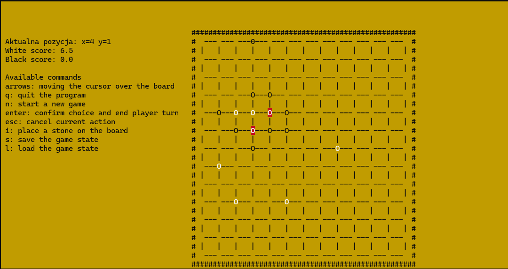
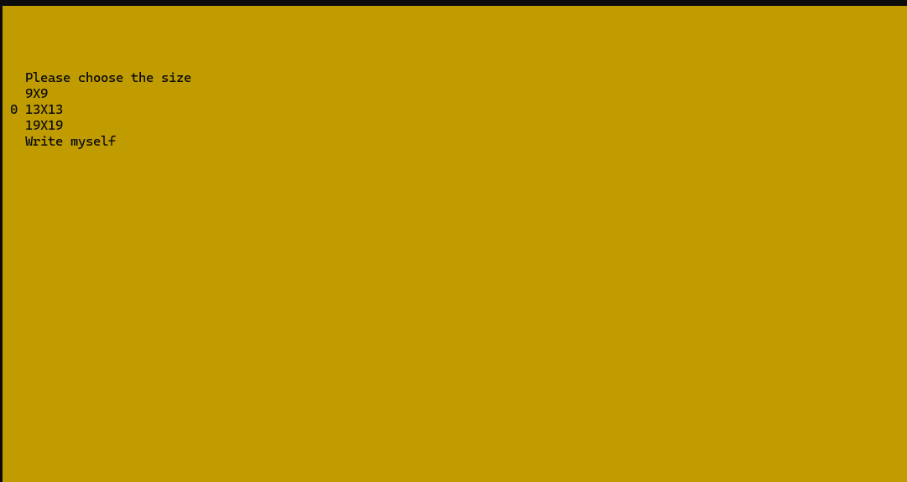
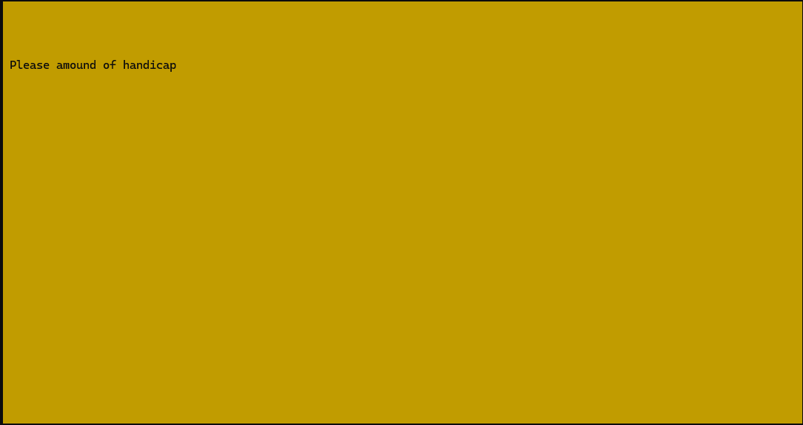

# Study project
## Go game in console

The goal of the project is to write a console application - a game `Go`. Rules you can find [here](https://en.wikipedia.org/wiki/Go_(game)).

The application is written using an analog of the `conio` library for c.

## Launching

The application is written for the Window platform and requires Visual Studio to run. To start it you need to open the project file `Project 1.sln` with Visual Studio and start the project build.

## Usage

At startup, the user is prompted to select the size of the field. The following options are available:
* 9 by 9
* 13 by 13 
* 19 by 19
* Type in yourself

Next, it is suggested that you enter the handicap amount. Then the game board appears and player number 1's turn begins. The current cursor position is displayed on the left, as well as the player score.

## Controls

A hint for the control buttons is shown on the left side. Also, the controls can be found below:

| Key | Action
| :-----: | -----
| <kbd>Arrows</kbd> | Move the cursor over the field
| <kbd>i</kbd> | Place a stone at the cursor position
| <kbd>Esc</kbd> | Get that rock off the field
| <kbd>Enter</kbd> | Confirm the placement of the stone and end the move
| <kbd>q</kbd> | Finish the game
| <kbd>n</kbd> | Start a new game
| <kbd>s</kbd> | Save the current game state
| <kbd>l</kbd> | Load a saved game

## Technical features

The app highlights stones that have only 1 liberty. It also tracks the `KO` rule and automatically removes stones that have no liberties left.

The application also allows you to record the current state of the game to a file. And then continue the game.

In the file `main` with the help of `define` keyword defined colors for the background and also for the text. If you want to change the design of the game it is enough to change these parameters.

## Screenshots
### Screenshot during the game

### Start menu

